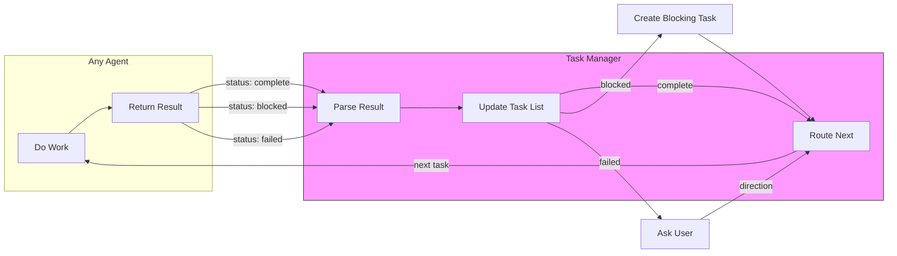
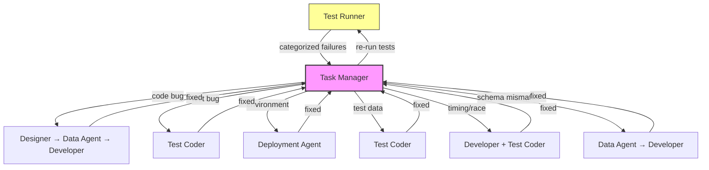

# Claude-Code Startup

A starter template for building applications with Claude Code using specialized sub-agents for structured development workflows.

## Overview

This template provides a complete set of sub-agents designed to orchestrate application development through distinct phases: requirements gathering, architecture, design, implementation, testing, and documentation. Each agent has a focused responsibility and communicates through structured handoffs managed by the Task Manager.

## Features

- **11 Specialized Agents** - Each with defined responsibilities, tools, and outputs
- **Structured Workflow** - Requirements → Architecture → Design → Implementation → Testing → Documentation
- **Language Conventions** - Pre-built coding and testing conventions for 6 languages
- **Task Orchestration** - Task Manager coordinates all agent work with dependency tracking
- **Document-Based Coordination** - No MCP servers required; agents communicate through markdown

## Sub-Agent Index

| Agent | Purpose | Model |
|-------|---------|-------|
| **Requirements** | Interactive requirements elicitation (ISO/IEC/IEEE 29148) | opus |
| **Architect** | Architectural decisions, ADRs, project-wide standards | opus |
| **Designer** | Design docs from requirements (IEEE 1016, Mermaid UML) | opus |
| **Task Manager** | Orchestrates workflow, tracks tasks, handles inter-agent requests | opus |
| **Test Designer** | Plans tests based on architecture and design | opus |
| **Data Agent** | Schemas as source of truth, data dictionaries, migrations | opus |
| **Deployment** | Environment config, Docker Compose, AWS CDK | opus |
| **Developer** | Implements code following project conventions | opus |
| **Test Coder** | Writes test code (unit, integration, E2E) | opus |
| **Test Runner** | Executes tests, debugs failures, routes issues | opus |
| **Documentation** | User docs, developer docs, code documentation | opus |

## Folder Structure

```
your-project/
├── .claude/
│   └── agents/            # Sub-agent definitions (copy from template)
├── Claude.md              # Project index and memory (customize per project)
├── conventions/           # Language-specific coding conventions
│   ├── developer/         # Code style (golang, java, python, react, swift, typescript)
│   └── testing/           # Test conventions (golang, java, python, react, swift, typescript)
├── developer-docs/        # Documentation for project contributors
├── user-docs/             # Documentation for end users
└── project-docs/
    ├── adrs/              # Architecture Decision Records
    ├── schemas/           # Data schemas (source of truth)
    └── *.md               # Requirements, designs, task lists
```

## Setup

### 1. Create Your Project from Template

**Option A: GitHub Web UI**

1. Click the green **"Use this template"** button at the top of the repository
2. Select **"Create a new repository"**
3. Name your repository and click **"Create repository"**
4. Clone your new repository locally:
   ```bash
   git clone https://github.com/YOUR-USERNAME/your-new-project.git
   cd your-new-project
   ```

**Option B: GitHub CLI**

```bash
gh repo create my-new-project --template osok/claude-code-startup --clone
cd my-new-project
```

**Option C: Manual Clone**

```bash
git clone https://github.com/osok/claude-code-startup.git my-new-project
cd my-new-project
rm -rf .git
git init
git add .
git commit -m "Initial commit from claude-code-startup template"
```

### 2. Customize Claude.md

Edit `Claude.md` to reflect your project:

1. Update the project name and overview
2. Clear the "Current Work" section
3. Reset the "Document Sequence Tracker" table
4. Add project-specific decisions to "Key Decisions & Concepts"

### 3. Create Initial Requirements

In Claude Code, describe what you want to build:

```
I want to create requirements for a user authentication system
```

The Requirements agent will interactively gather requirements and create the document for you.

## Usage

### Starting New Work

Tell Claude Code:
```
begin work
```

The Task Manager will:
1. Read `Claude.md` for context
2. Load the requirements document
3. Execute planning (Architect → Designer)
4. Create the task list
5. Execute implementation (Test Designer → Data Agent → Developer → Tests → Docs)

### Resuming Work

Tell Claude Code:
```
continue
```

The Task Manager will:
1. Load the current task list
2. Reset any stale in-progress tasks
3. Find the next actionable task
4. Resume the workflow

### Interactive Requirements

To gather requirements interactively, invoke the Requirements agent directly. It will guide you through structured elicitation following ISO/IEC/IEEE 29148 standards.

## Workflow Order

The Task Manager orchestrates agents in this order:

1. **Test Designer** - Plans test approach based on design
2. **Data Agent** - Creates/updates schemas
3. **Deployment** - Configures environments
4. **Developer** - Implements features
5. **Test Designer** - Reviews and updates test plans
6. **Test Coder** - Writes test code
7. **Test Runner** - Executes tests, routes failures
8. **Documentation** - Generates user and developer docs

### Workflow Diagram

```mermaid
flowchart TD
    subgraph Planning["Planning Phase"]
        REQ[Requirements Agent]
        ARCH[Architect Agent]
        DES[Designer Agent]
    end

    subgraph Implementation["Implementation Phase"]
        TD[Test Designer]
        DA[Data Agent]
        DEP[Deployment Agent]
        DEV[Developer Agent]
        TD2[Test Designer Review]
        TC[Test Coder]
        TR[Test Runner]
        DOC[Documentation Agent]
    end

    TM[Task Manager]

    %% Planning flow
    REQ -->|requirements doc| TM
    TM -->|begin work| ARCH
    ARCH -->|ADRs, architecture| TM
    TM --> DES
    DES -->|design doc| TM

    %% Implementation flow
    TM --> TD
    TD -->|test plan| TM
    TM --> DA
    DA -->|schemas| TM
    TM --> DEP
    DEP -->|env config| TM
    TM --> DEV
    DEV -->|code| TM
    TM --> TD2
    TD2 -->|updated tests| TM
    TM --> TC
    TC -->|test code| TM
    TM --> TR
    TR -->|results| TM
    TM --> DOC
    DOC -->|docs| TM

    %% Completion states
    TM -->|all complete| DONE[Done]

    %% Blocked handling
    DEV -.->|blocked| TM
    TC -.->|blocked| TM
    TM -.->|creates blocking task| DA
    TM -.->|creates blocking task| DEV

    %% Test failure routing
    TR -.->|code bug| TM
    TM -.->|route fix| DES
    DES -.->|design update| TM
    TM -.->|schema change| DA
    TM -.->|implement fix| DEV

    TR -.->|test bug| TM
    TM -.->|fix test| TC

    style TM fill:#f9f,stroke:#333,stroke-width:3px
    style DONE fill:#9f9,stroke:#333
```



### Agent Result Flow



### Test Failure Routing



## Conventions

Pre-built conventions are included for:

| Language | Developer | Testing |
|----------|-----------|---------|
| Go | `conventions/developer/golang.md` | `conventions/testing/golang.md` |
| Java | `conventions/developer/java.md` | `conventions/testing/java.md` |
| Python | `conventions/developer/python.md` | `conventions/testing/python.md` |
| React | `conventions/developer/react.md` | `conventions/testing/react.md` |
| Swift | `conventions/developer/swift.md` | `conventions/testing/swift.md` |
| TypeScript | `conventions/developer/typescript.md` | `conventions/testing/typescript.md` |

Add new conventions by creating files in the appropriate folder.

## Task List Format

Task lists track work with dependency management:

```markdown
| ID | Task | Status | Blocked-By | Agent | Notes |
|----|------|--------|------------|-------|-------|
| T001 | Create schema | complete | - | Data Agent | |
| T002 | Implement API | blocked | T004 | Developer | Needs auth |
| T003 | Write tests | pending | T002 | Test Coder | |
| T004 | Setup auth | in-progress | - | Developer | Created for T002 |
```

**Statuses:** `pending` | `in-progress` | `blocked` | `complete`

## Key Concepts

- **Task Manager as Sole Writer** - Only Task Manager modifies task lists; other agents return structured output
- **Schemas as Source of Truth** - Data Agent maintains schemas; all developers reference these
- **Test Runner Routing** - App bugs route through Designer → Data Agent → Developer; test bugs go to Test Coder
- **Mid-Task Requests** - Agents can request blocking work; Task Manager queues and resumes appropriately
- **Chain Depth Limit** - Maximum 3 levels of blocking dependencies to prevent infinite loops

## Related

- [cursor-startup](https://github.com/osok/cursor-startup) - Similar template for Cursor IDE

## License

MIT
